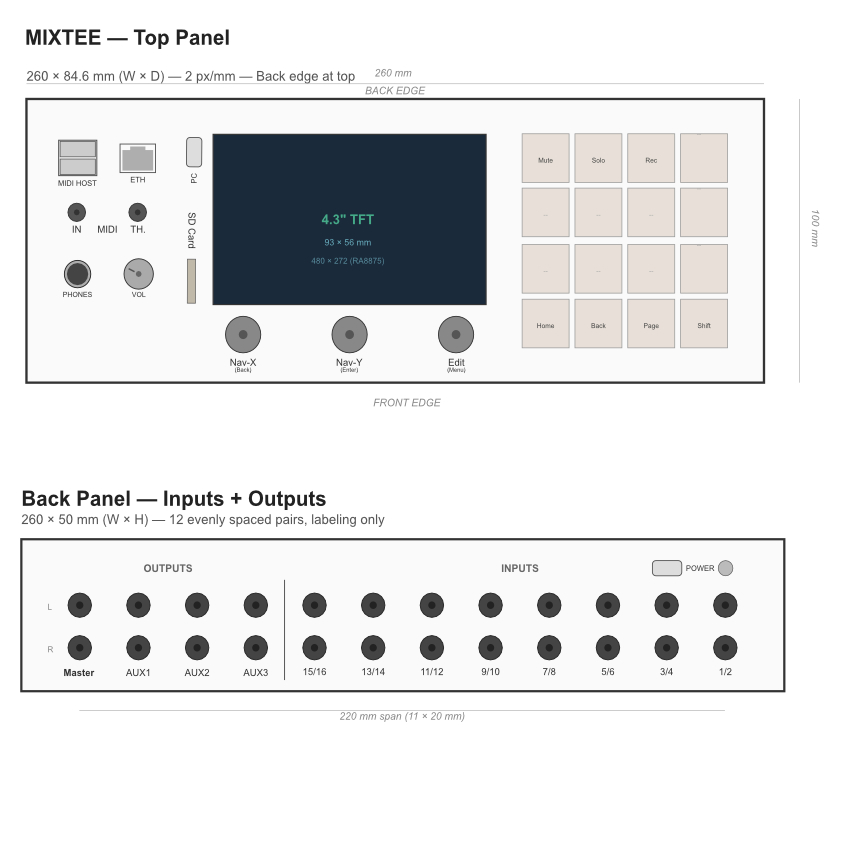

# MIXTEE

**Open-source 16-input / 8-output digital mixer with MIDI control and 16-track recording.**

Built around the Teensy 4.1, MIXTEE is a compact desktop mixer designed for electronic musicians, synth enthusiasts, and DIY audio builders. It handles mixing, monitoring, MIDI control, multitrack recording to SD card, and 2-in/2-out USB audio — all in a 260 × 84.6 × 50 mm enclosure.



## Features

- **16 mono inputs** (8 stereo pairs) with per-channel gain, pan, mute, solo
- **8 outputs** (master stereo + 3 aux/FX sends)
- **16-track recording** direct to SD card (48 kHz / 24-bit WAV, 8 MB PSRAM buffer)
- **USB audio interface** (2-in / 2-out, USB Audio Class 1)
- **MIDI control** via 2× USB host ports + 5-pin DIN input
- **4.3" TFT display** with dedicated nav/edit encoders and 12 illuminated CHOC keys
- **Compact form factor** — 260 × 84.6 × 50 mm, all controls on top, all audio on back

## Architecture

MIXTEE uses four AK4619VN codecs on two TDM buses, driven by the Teensy 4.1's Cortex-M7 at 600 MHz. The analog front-end features OPA1678 op-amps with Sallen-Key anti-alias and reconstruction filters. Power is supplied via a dedicated USB-C port (5V/3A) with a separate USB-C for computer data, eliminating ground loop noise.

## Repository Structure

```
mixtee/
├── README.md           ← you are here
├── LICENSE             ← MIT (firmware) + CERN-OHL-P v2 (hardware) + CC BY 4.0 (docs)
├── docs/               ← design documents and specifications
│   ├── features.md     ← control interface, mixing, recording, MIDI, USB audio
│   ├── hardware.md     ← codecs, analog stages, power system, BOM, target specs
│   ├── firmware.md     ← software architecture, libraries, state management
│   ├── ui-architecture.md  ← view/page/module hierarchy, screen layouts
│   ├── enclosure.md    ← physical dimensions, panel layouts, jack spacing
│   ├── usb-audio.md    ← USB audio details + optional multitrack upgrade paths
│   └── pcb-architecture.md ← board definitions, interconnects, connectors
├── hardware/           ← schematics, PCB, mechanical, BOM
│   ├── bom.csv         ← bill of materials
│   ├── mixtee-layout.svg    ← panel layout drawing (editable)
│   ├── mixtee-layout.jpg    ← panel layout render
│   ├── mixtee-layout.afdesign  ← Affinity Designer source
│   └── reference/      ← reference materials
└── firmware/           ← Teensy 4.1 firmware (coming in Phase 1)
```

## Documentation

| Document | Description |
| --- | --- |
| [Features](docs/features.md) | Mixing, routing, recording, MIDI control, USB audio |
| [Hardware](docs/hardware.md) | Codec architecture, analog design, power system, BOM, specs |
| [Firmware](docs/firmware.md) | Software architecture, audio pipeline, state management |
| [UI Architecture](docs/ui-architecture.md) | Display hierarchy, navigation model, screen layouts |
| [Enclosure](docs/enclosure.md) | Physical dimensions, panel layouts, connector placement |
| [USB Audio](docs/usb-audio.md) | USB audio interface details and future upgrade options |
| [PCB Architecture](docs/pcb-architecture.md) | Board definitions, interconnects, connector plan |

## Status

**Pre-prototype / Design phase.** Hardware and firmware specifications are being finalized. Phase 1 breadboard bring-up is next.

## License

MIXTEE is fully open source. Hardware is licensed under CERN-OHL-P v2, firmware under MIT, and documentation under CC BY 4.0. See [LICENSE](LICENSE) for details.

**Author:** Juliusz Fedyk — [openmusictools.com](https://openmusictools.com)
