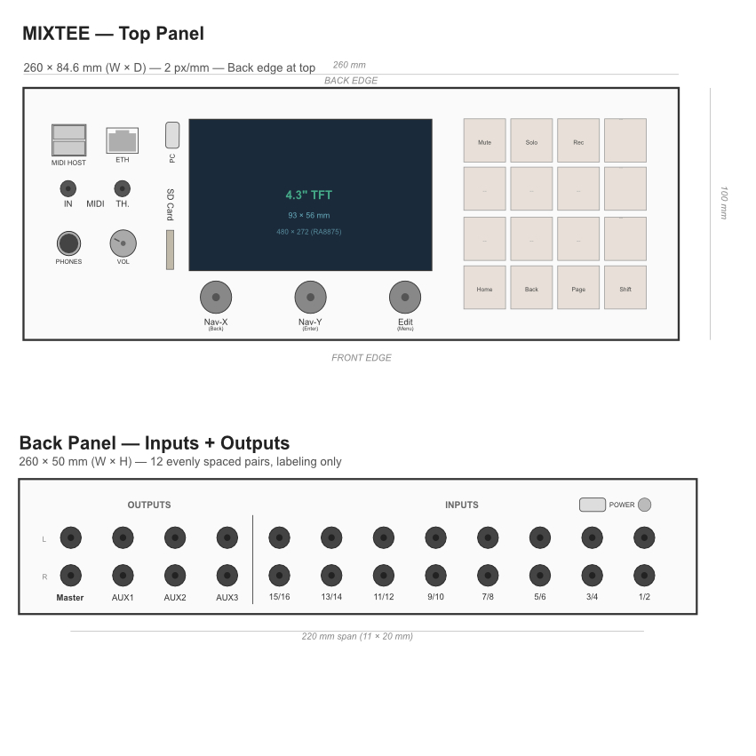

# MIXTEE

**Open-source 16-input / 8-output digital mixer with MIDI control and 16-track recording.**

Built around the Teensy 4.1, MIXTEE is a compact desktop mixer designed for electronic musicians, synth enthusiasts, and DIY audio builders. It handles mixing, monitoring, MIDI control, multitrack recording to SD card, and 16-in/8-out AES67 network audio — all in a 260 × 100 × 50 mm enclosure.



## Features

- **16 mono inputs** (8 stereo pairs) with per-channel gain, pan, mute, solo
- **8 outputs** (master stereo + 3 aux/FX sends)
- **16-track recording** direct to SD card (48 kHz / 24-bit WAV, 8 MB PSRAM buffer)
- **DAW connectivity** (16-in / 8-out via AES67 over Ethernet)
- **MIDI control** via 2× USB host ports + TRS MIDI in/out
- **4.3" TFT display** with 3 dedicated encoders (NavX, NavY, Edit) and 16 illuminated CHOC keys
- **Compact form factor** — 260 × 100 × 50 mm, all controls on top, all audio on back

## Architecture

MIXTEE uses four AK4619VN codecs on two TDM buses, driven by the Teensy 4.1's Cortex-M7 at 600 MHz. The analog front-end features OPA1678 op-amps with Sallen-Key anti-alias and reconstruction filters. Power is supplied via USB-C (5V/5A USB PD, fallback 5V/3A). DAW connectivity uses AES67 network audio over Ethernet (100 Mbps, DP83825I PHY on Teensy).

## Repository Structure

```
mixtee/
├── README.md              ← you are here
├── LICENSE                ← MIT (firmware) + CERN-OHL-P v2 (hardware) + CC BY 4.0 (docs)
├── docs/                  ← system-level design specifications
│   ├── system-topology.md ← board summary, connector summary, back panel layout
│   ├── hardware.md        ← codecs, power system, BOM, target specs
│   ├── pin-mapping.md     ← Teensy 4.1 pin assignments, GPIO budget
│   ├── features.md        ← control interface, mixing, recording, MIDI, USB audio
│   ├── firmware.md        ← software architecture, libraries, state management
│   ├── ui-architecture.md ← view/page/module hierarchy, screen layouts
│   ├── enclosure.md       ← physical dimensions, panel layouts, jack spacing
│   ├── usb-audio.md       ← USB audio details + optional multitrack upgrade paths
│   ├── connector-parts.md ← connector MPN index
│   ├── pcb-design-rules.md ← trace widths, clearances, via sizes, manufacturing
│   └── pcbs-workflow.md   ← PCB design pipeline (SKiDL → FreeRouting → Gerbers)
├── hardware/              ← schematics, PCB, mechanical, BOM
│   ├── bom.csv            ← bill of materials
│   ├── mixtee-layout.*    ← panel layout (SVG, JPG, Affinity Designer)
│   ├── lib/               ← shared KiCad footprint library
│   └── pcbs/              ← per-board directories
│       ├── main/              ← Main Board (4-layer, not started)
│       ├── input-mother/      ← Input Mother Board (4-layer, routed)
│       ├── daughter-output/   ← Daughter/Output Board (2-layer, routed)
│       ├── io/                ← IO Board (2-layer, routed)
│       ├── key/               ← Key PCB (2-layer, routed)
│       └── power/             ← Power Board (off-the-shelf)
│       Each board has: README.md, connections.md, architecture.md,
│       CLAUDE.md, and designs/ (KiCad files + gerbers)
└── firmware/              ← Teensy 4.1 firmware (coming in Phase 1)
```

## Documentation

### System-Level Docs

| Document | Description |
| --- | --- |
| [System Topology](docs/system-topology.md) | Board summary, connector summary, back panel layout, mechanical mounting |
| [Hardware](docs/hardware.md) | Codec architecture, power system, BOM tables, target specs |
| [Pin Mapping](docs/pin-mapping.md) | Teensy 4.1 pin assignments, GPIO budget |
| [Features](docs/features.md) | Mixing, routing, recording, MIDI control, DAW audio |
| [Firmware](docs/firmware.md) | Software architecture, audio pipeline, state management |
| [UI Architecture](docs/ui-architecture.md) | Display hierarchy, navigation model, screen layouts |
| [Enclosure](docs/enclosure.md) | Physical dimensions, panel layouts, connector placement |
| [Network Connectivity](docs/network-connectivity.md) | AES67 network audio, DAW integration, discovery protocols |
| [Connector Parts](docs/connector-parts.md) | Connector MPN index |
| [PCB Design Rules](docs/pcb-design-rules.md) | Trace widths, clearances, via sizes, stackup, manufacturing rules |

### Per-Board Docs

Each board under `hardware/pcbs/` has its own `README.md` (concept), `connections.md` (pinouts), and `architecture.md` (circuits). See the [System Topology](docs/system-topology.md) for the board summary table with links.

## Status

**Pre-prototype / Design phase.** Hardware and firmware specifications are being finalized. Phase 1 breadboard bring-up is next.

## License

MIXTEE is fully open source. Hardware is licensed under CERN-OHL-P v2 (permissive), firmware under MIT, and documentation under CC BY 4.0. See [LICENSE](LICENSE) for details.

**Author:** Juliusz Fedyk — [openmusictools.com](https://openmusictools.com)
