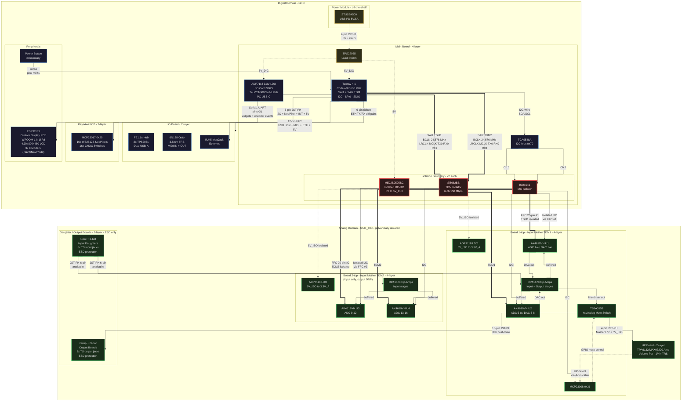

# MIXTEE: Hardware Architecture Diagram

*Back to [README](../README.md) | See also: [System Topology](system-topology.md) | [Hardware](hardware.md)*

------

## System Block Diagram

------

## Legend

| Line style | Meaning |
|-----------|---------|
| `==` thick solid | TDM audio (24.576 MHz BCLK) |
| `--` solid | Control / data (I2C, SPI, USB, Serial, GPIO) |
| `-.` dotted | Power distribution, passive connections, detect signals |

| Node color | Domain |
|-----------|--------|
| Blue border | Digital domain (GND) |
| Green border | Analog domain (GND_ISO) |
| Red border, thick | Galvanic isolation boundary components |
| Yellow border | Power entry / switching |

------

## Signal Path Summary

**Audio input:** 1/4" TS jack > ESD diode (daughter board) > JST-PH cable > op-amp buffer + anti-alias filter (mother board) > AK4619VN ADC > TDM > Si8662BB isolator > FFC 20-pin > Teensy SAI RX

**Audio output:** Teensy SAI TX > FFC 20-pin > Si8662BB isolator > AK4619VN DAC > reconstruction filter + output op-amp > TS5A3159 mute switch > 10-pin JST-PH cable > 1/4" TS jack (output board)

**Headphone:** DAC output (Board 1-top) > TS5A3159 > 4-pin JST-PH > TPA6132/MAX97220 amp > volume pot > 1/4" TRS jack. Detect switch returns to MCP23008 GP6 via same cable.

**DAW audio:** Ethernet (AES67) > RJ45 MagJack (IO Board) > 6-pin ribbon > Teensy DP83825I PHY > QNEthernet stack > RTP encode/decode. 16-in / 8-out to DAW via virtual soundcard. See [network-connectivity.md](network-connectivity.md) §9.

**Isolation boundary:** 2x Si8662BB (TDM), 2x ISO1541 (I2C), 2x MEJ2S0505SC (power) -- all on Main Board, crossing via FFC 20-pin cables to mother boards
